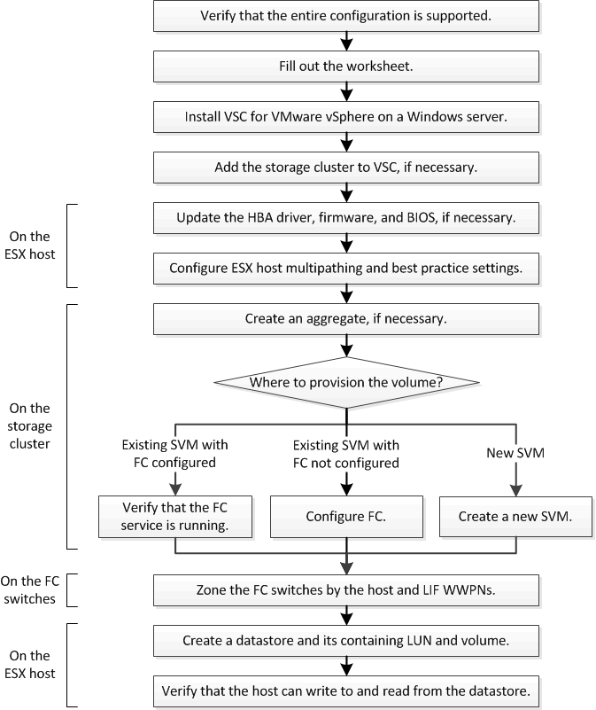

= Flujo de trabajo de configuración de FC
:allow-uri-read: 
:icons: font
:imagesdir: ../media/

[role="lead"]
Cuando hace que el almacenamiento esté disponible para un host mediante FC, debe aprovisionar un volumen y un LUN en la máquina virtual de almacenamiento (SVM) y, a continuación, conectarse al LUN desde el host.

