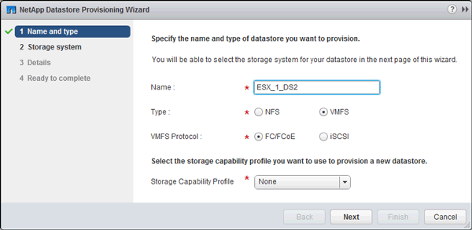

= Aprovisione un almacén de datos y cree su LUN y volumen que contenga
:allow-uri-read: 
:icons: font
:imagesdir: ../media/

[role="lead"]
Un almacén de datos contiene máquinas virtuales y sus VMDK en el host ESXi. El almacén de datos en el host ESXi se aprovisiona en un LUN en el clúster de almacenamiento.

.Antes de empezar
Virtual Storage Console para VMware vSphere (VSC) debe estar instalado y registrado en el vCenter Server que gestiona el host ESXi.

VSC debe tener suficientes credenciales de clúster o máquina virtual de almacenamiento (SVM) para crear el LUN y el volumen.

.Acerca de esta tarea
VSC automatiza el aprovisionamiento del almacén de datos, incluida la creación de un LUN y un volumen en la SVM especificada.

.Pasos
. En la página Home* de vSphere Web Client, haga clic en *hosts and Clusters*.
. En el panel de navegación, expanda el centro de datos donde desea aprovisionar el almacén de datos.
. Haga clic con el botón derecho en el host ESXi y seleccione *NetApp VSC* > *Provision Datastore*.
+
Como alternativa, puede hacer clic con el botón derecho en el clúster cuando el aprovisionamiento para que el almacén de datos esté disponible para todos los hosts del clúster.

. Proporcione la información requerida en el asistente:
+

+
** Seleccione *VMFS* como tipo de almacén de datos.
** Seleccione *FC/FCoE* como protocolo VMFS.
** Seleccione *Ninguno* como el Perfil de capacidad de almacenamiento.
** Seleccione la casilla para *provisión fina*.
** Seleccione la casilla de verificación *Crear nuevo volumen*.

