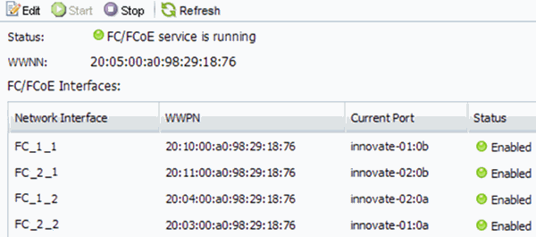

= Compruebe que el servicio FC está en ejecución en una SVM existente
:allow-uri-read: 
:icons: font
:imagesdir: ../media/

[role="lead"]
Si decide utilizar una máquina virtual de almacenamiento (SVM) existente, debe comprobar que el servicio FC se ejecuta en la SVM mediante ONTAP System Manager. También debe verificar que las interfaces lógicas (LIF) de FC ya se han creado.

.Antes de empezar
Debe haber seleccionado una SVM existente en la que planea crear una nueva LUN.

.Pasos
. Vaya a la ventana *SVMs*.
. Seleccione la SVM requerida.
. Haga clic en la ficha *Configuración de SVM*.
. En el panel *Protocolos*, haga clic en *FC/FCoE*.
. Compruebe que el servicio FC está en ejecución.
+

+
Si el servicio FC no está en ejecución, inicie el servicio FC o cree una SVM nueva.

. Compruebe que hay al menos dos LIF de FC enumeradas para cada nodo.
+
Si hay menos de dos LIF de FC por nodo, actualice la configuración de FC en la SVM o cree una nueva SVM para FC.

