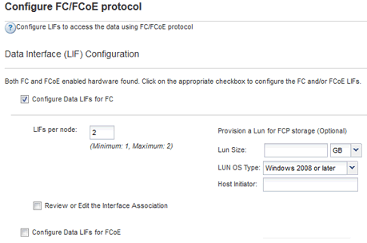

= Configurar FC en una SVM existente
:allow-uri-read: 
:icons: font
:imagesdir: ../media/

[role="lead"]
Puede configurar FC en una máquina virtual de almacenamiento (SVM) existente y crear una LUN y su volumen contenedor con un solo asistente. El protocolo FC ya debe estar habilitado pero no configurado en la SVM. Esta información está destinada a las SVM para las que va a configurar varios protocolos, pero aún no ha configurado FC.

.Antes de empezar
Debe configurarse la estructura FC y los puertos físicos deseados deben conectarse a la estructura.

.Pasos
. Vaya a la ventana *SVMs*.
. Seleccione la SVM que desea configurar.
. En el panel SVM**Details**, compruebe que *FC/FCoE* se muestra con un fondo gris, lo que indica que el protocolo está habilitado pero no está completamente configurado.
+
Si *FC/FCoE* aparece con un fondo verde, la SVM ya está configurada.

+
image::../media/existing_svm_protocols_fc_windows.gif[La imagen muestra la página de detalles con los cuatro protocolos con fondos grises.]

. Haga clic en el enlace del protocolo *FC/FCoE* con el fondo gris.
+
Aparecerá la ventana Configurar protocolo FC/FCoE.

. Configure el servicio FC y las LIF desde la página *Configurar protocolo FC/FCoE*:
+
.. Active la casilla de verificación *Configurar LIF de datos para FC*.
.. Introduzca `2` En el campo *LIF por nodo*.
+
Por cada nodo se necesitan dos LIF para garantizar la disponibilidad y la movilidad de datos.

.. En el área *Provision a LUN for FCP Storage*, introduzca el tamaño de LUN, el tipo de host y los WWPN deseados de los iniciadores de host.
.. Haga clic en *Enviar y cerrar*.

+

. Revise la página *Resumen*, registre la información de LIF y, a continuación, haga clic en *Aceptar*.

