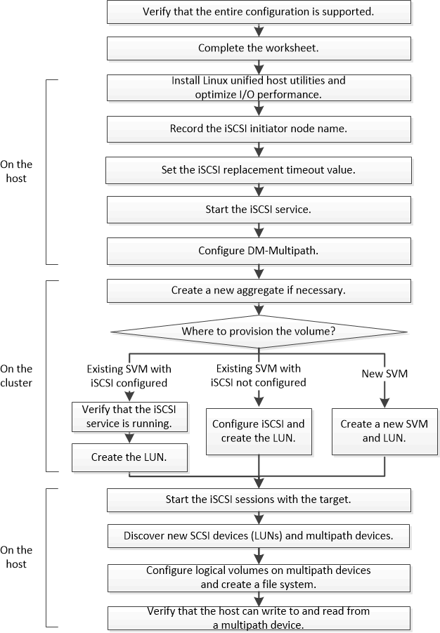

= Flujo de trabajo de configuración y aprovisionamiento iSCSI
:allow-uri-read: 
:icons: font
:imagesdir: ../media/

[role="lead"]
Cuando se hace que el almacenamiento esté disponible para un host mediante iSCSI, se aprovisiona un volumen y un LUN en la máquina virtual de almacenamiento (SVM) y, luego, se conecta al LUN desde el host.

