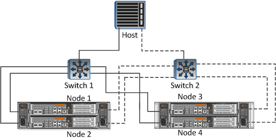

= Rellene la hoja de configuración de iSCSI
:allow-uri-read: 
:icons: font
:imagesdir: ../media/

[role="lead"]
Es necesario contar con identificadores de iSCSI, direcciones de red e información de configuración de almacenamiento para realizar las tareas de configuración de iSCSI.

== Identificadores de iSCSI

|===
| Nombre de nodo iSCSI (IQN) del iniciador (host) 

 a| 
Alias de destino (opcional)

|===

== Direcciones de red de destino

La máquina virtual de almacenamiento (SVM) es el destino iSCSI.

Necesita una subred con dos direcciones IP para LIF de datos iSCSI para cada nodo del clúster. Debería haber dos redes separadas para una alta disponibilidad. ONTAP asigna las direcciones IP específicas cuando crea las LIF como parte de la creación de la SVM.

Si es posible, separe el tráfico iSCSI en redes físicas o en VLAN.

Subred para LIF:

|===
| Nodo o LIF con puerto al switch | Dirección IP | Máscara de red | Puerta de enlace | ID DE VLAN | Puerto de inicio 

 a| 
Nodo 1 / LIF al switch 1
 a| 
 a| 
 a| 
 a| 
 a| 

 a| 
Nodo 2 / LIF al switch 1
 a| 
 a| 
 a| 
 a| 
 a| 

 a| 
Nodo 3/LIF al switch 1
 a| 
 a| 
 a| 
 a| 
 a| 

 a| 
Nodo 4 / LIF al switch 1
 a| 
 a| 
 a| 
 a| 
 a| 

 a| 
Nodo 1 / LIF al switch 2
 a| 
 a| 
 a| 
 a| 
 a| 

 a| 
Nodo 2 / LIF al switch 2
 a| 
 a| 
 a| 
 a| 
 a| 

 a| 
Nodo 3 / LIF al switch 2
 a| 
 a| 
 a| 
 a| 
 a| 

 a| 
Nodo 4 / LIF al switch 2
 a| 
 a| 
 a| 
 a| 
 a| 

|===

== Configuración del almacenamiento

Si el agregado y la SVM ya se han creado, registre sus nombres aquí; de lo contrario, puede crearlos según sea necesario:

|===
| Del nodo a su propia LUN 

 a| 
Nombre del agregado

 a| 
Nombre de SVM

|===

== Información de LUN

|===
| Tamaño de LUN 

 a| 
Nombre de LUN (opcional)

 a| 
Descripción de LUN (opcional)

|===

== Información de la SVM

Si no utiliza una SVM existente, requiere la siguiente información para crear una SVM nueva:

[cols="1a,1a"]
|===
2+| Nombre de SVM 

 a| 
Espacio IP de SVM

 a| 
Agregado para el volumen raíz de la SVM

 a| 
Nombre de usuario de SVM (opcional)

 a| 
Contraseña de SVM (opcional)

 a| 
LIF de gestión de SVM (opcional)

 a| 
 a| 
Subred:

 a| 
 a| 
Dirección IP:

 a| 
 a| 
Máscara de red:

 a| 
 a| 
Puerta de enlace:

 a| 
 a| 
Nodo principal:

 a| 
 a| 
Puerto de inicio:

|===