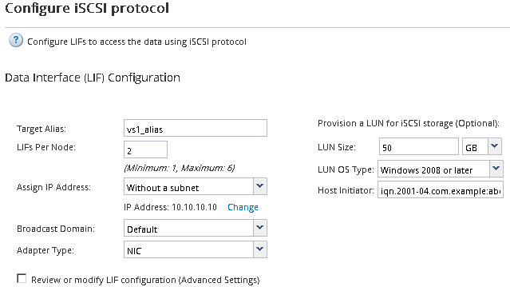

= Cree una SVM nueva
:allow-uri-read: 
:icons: font
:imagesdir: ../media/

[role="lead"]
La máquina virtual de almacenamiento (SVM) proporciona el destino iSCSI a través del cual un host accede a los LUN. Cuando crea la SVM, también crea interfaces lógicas (LIF) y la LUN, y su volumen que contiene. Es posible crear una SVM para separar las funciones de administración y datos de un usuario de las de otros usuarios en un clúster.

.Antes de empezar
* Debe tener suficientes direcciones de red disponibles para crear dos LIF por cada nodo.

.Acerca de esta tarea
Las LUN se asignan a un subconjunto de los iniciadores del igroup para limitar el número de rutas desde el host a la LUN.

* De forma predeterminada, ONTAP utiliza la asignación de LUN selectiva (SLM) para hacer que el LUN solo esté accesible a través de las rutas del nodo al que pertenece la LUN y su partner de alta disponibilidad.
* Aún debe configurar todos los LIF iSCSI en cada nodo para la movilidad de LUN en caso de que la LUN se mueva a otro nodo del clúster.
* A la hora de mover un volumen o un LUN, debe modificar la lista SLM-reporting-Nodes antes de mover.

.Pasos
. Vaya a la ventana *SVMs*.
. Haga clic en *Crear*.
. En la ventana *Storage Virtual Machine (SVM) Setup* (Configuración de la máquina virtual de almacenamiento), cree la SVM:
+
image::../media/svm_setup_details_page_ntfs_selected_iscsi_windows.gif[En la ilustración, se muestra la creación de una SVM con un estilo de seguridad NTFS]

+
.. Especifique un nombre único para la SVM.
+
El nombre debe ser un nombre de dominio completo (FQDN) o seguir otra convención que garantice nombres únicos en un clúster.

.. Seleccione el espacio IP al que pertenecerá la SVM.
+
Si el clúster no utiliza varios espacios IP, se utiliza el espacio IP «predeterminado».

.. Mantenga la selección de tipo de volumen predeterminada.
+
Solo los volúmenes FlexVol son compatibles con protocolos SAN.

.. Seleccione todos los protocolos para los que tenga licencias y para los que pueda usar en la SVM, incluso si no desea configurar todos los protocolos inmediatamente.
+
Al seleccionar NFS y CIFS cuando se crea la SVM, estos dos protocolos pueden compartir las mismas LIF. Al agregar más adelante estos protocolos no los permite compartir LIF.

+
Si CIFS es uno de los protocolos seleccionados, el estilo de seguridad se establece en NTFS. De lo contrario, el estilo de seguridad se establece en UNIX.

.. Mantenga la configuración de idioma predeterminada C.UTF-8.
.. Seleccione el agregado raíz deseado para contener el volumen raíz de SVM.
+
El agregado para el volumen de datos se selecciona por separado en el paso posterior.

.. Haga clic en *Enviar y continuar*.

+
La SVM se ha creado, pero aún no se han configurado los protocolos.

. Si aparece la página *Configurar protocolo CIFS/NFS* porque ha activado CIFS o NFS, haga clic en *Omitir* y, a continuación, configure CIFS o NFS más adelante.
. Configure el servicio iSCSI y cree LIF, así como el LUN y el volumen que lo contiene desde la página *Configurar protocolo iSCSI*:
+
.. *Opcional:* Introduzca un nombre de alias de destino.
.. Asigne la dirección IP para las LIF mediante una subred o sin una subred.
.. Introduzca `*2*` En el campo *LIF por nodo*.
+
Por cada nodo se necesitan dos LIF para garantizar la disponibilidad y la movilidad de datos.

.. En el área *Provision a LUN for iSCSI Storage*, introduzca el tamaño de LUN, el tipo de host y el nombre de iniciador iSCSI que desee del host.
.. Haga clic en *Enviar y continuar*.

+

. Si aparece la página *Configurar protocolo FC/FCoE* porque ha activado FC, haga clic en *Omitir* y, a continuación, configure FC más tarde.
. Cuando aparezca *Administración de SVM*, configure o aplace la configuración de un administrador independiente para esta SVM:
+
** Haga clic en *Omitir* y configure un administrador más tarde si lo desea.
** Introduzca la información solicitada y, a continuación, haga clic en *Enviar y continuar*.

. Revise la página *Resumen*, registre la información de LIF y, a continuación, haga clic en *Aceptar*.

