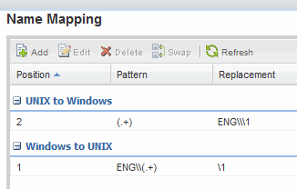

= Asignar nombres de usuario de UNIX y Windows
:allow-uri-read: 
:icons: font
:imagesdir: ../media/

[role="lead"]
Si el sitio tiene cuentas de usuario de Windows y UNIX, debe utilizar la asignación de nombres para asegurarse de que los usuarios de Windows pueden tener acceso a los archivos con permisos de archivo UNIX y asegurarse de que los usuarios de UNIX pueden tener acceso a los archivos con permisos de archivo NTFS. La asignación de nombres puede implicar cualquier combinación de asignación implícita, reglas de conversión y usuarios predeterminados.

.Acerca de esta tarea
Debe utilizar este procedimiento sólo si el sitio tiene cuentas de usuario de Windows y UNIX que no se asignan implícitamente, que es cuando la versión en minúscula de cada nombre de usuario de Windows coincide con el nombre de usuario de UNIX. Esto puede realizarse utilizando usuarios NIS, LDAP o locales. Si tiene dos conjuntos de usuarios que no coinciden, debe configurar la asignación de nombres.

.Pasos
. Decida un método de asignación de nombres (reglas de conversión de asignación de nombres, asignaciones de usuarios predeterminadas o ambas) teniendo en cuenta los siguientes factores:
+
** Las reglas de conversión utilizan expresiones regulares para convertir un nombre de usuario a otro, lo que resulta útil si desea controlar o realizar un seguimiento del acceso a un nivel individual.
+
Por ejemplo, puede asignar usuarios de UNIX a usuarios de Windows en un dominio y viceversa.

** Los usuarios predeterminados le permiten asignar un nombre de usuario a todos los usuarios que no están asignados por asignaciones implícitas o reglas de conversión de asignación de nombres.
+
Cada SVM tiene un usuario UNIX predeterminado denominado «'pcuser'», pero no cuenta con un usuario de Windows predeterminado.

. Vaya a la ventana *SVMs*.
. Seleccione la SVM que desea configurar.
. Haga clic en la ficha *Configuración de SVM*.
. *Opcional*: Cree una asignación de nombres que convierta las cuentas de usuario UNIX en cuentas de usuario de Windows y viceversa:
+
.. En el panel *usuarios de host y grupos*, haga clic en *asignación de nombres*.
.. Haga clic en *Agregar*, conserve la dirección predeterminada de *Windows a UNIX* y, a continuación, cree una expresión regular que genere una credencial UNIX cuando un usuario de Windows intente tener acceso a un archivo que utilice permisos de archivo UNIX.
+
Utilice la siguiente entrada para convertir cualquier usuario de Windows en el dominio ENG en un usuario UNIX con el mismo nombre. El patrón `ENG\\(.+)` Busca cualquier nombre de usuario de Windows con el prefijo `ENG\\`, y la sustitución `\1` Crea la versión UNIX eliminando todo excepto el nombre de usuario.

+
image::../media/name_mappings_1_windows_to_unix.gif[Captura de pantalla de una entrada de Windows a UNIX]

.. Haga clic en ** Add**, seleccione la dirección de *UNIX a Windows* y, a continuación, cree la asignación correspondiente que genere una credencial de Windows cuando un usuario de UNIX intente acceder a un archivo que tenga permisos de archivo NTFS.
+
Utilice la siguiente entrada para convertir cada usuario UNIX en un usuario Windows con el mismo nombre en el dominio ENG. El patrón `(.+)` Busca cualquier nombre UNIX y el reemplazo `ENG\\\1` Crea la versión de Windows insertando `ENG\\` antes del nombre de usuario.

+
image::../media/name_mappings_2_unix_to_windows.gif[Captura de pantalla de una entrada de UNIX a Windows]

.. Dado que la posición de cada regla determina el orden en el que se aplican las reglas, debe revisar el resultado y confirmar que el pedido coincide con sus expectativas.
+

.. Repita los pasos 5b a 5d para asignar todos los dominios y los nombres de la SVM.

. *Opcional*: Cree un usuario predeterminado de Windows:
+
.. Cree una cuenta de usuario de Windows en LDAP, NIS o los usuarios locales de la SVM.
+
Si utiliza usuarios locales, puede crear una cuenta en *Windows* en el panel usuarios y grupos de host.

.. Defina el usuario predeterminado de Windows seleccionando *NFS* > *Editar* en el panel *Protocolos* e introduciendo el nombre de usuario.

+
Puede crear un usuario local de Windows llamado "'unixusers'" y establecerlo como usuario predeterminado de Windows.

. *Opcional*: Configure el usuario UNIX predeterminado si desea un usuario diferente del valor predeterminado, que es el usuario "'pcuser'".
+
.. Cree una cuenta de usuario de UNIX en LDAP, NIS o los usuarios locales de la SVM.
+
Si utiliza usuarios locales, puede crear una cuenta en *UNIX* en el panel usuarios y grupos host.

.. Defina el usuario UNIX predeterminado seleccionando *CIFS* > *Opciones* en el panel *Protocolos* e introduciendo el nombre de usuario.

+
Puede crear un usuario local de UNIX denominado «'winusers'» y establecerlo como usuario predeterminado de UNIX.

== Qué hacer a continuación

Si ha configurado usuarios predeterminados, al configurar los permisos de archivo más adelante en el flujo de trabajo, debe establecer permisos para el usuario predeterminado de Windows y el usuario predeterminado de UNIX.
