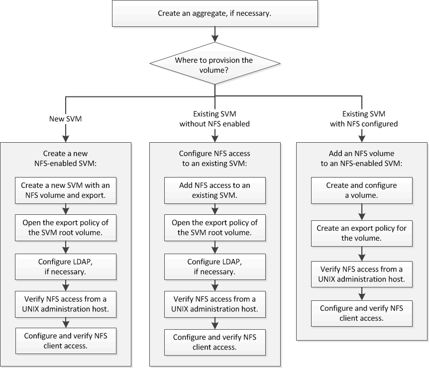

= Flujo de trabajo de configuración de NFS
:allow-uri-read: 
:icons: font
:imagesdir: ../media/

[role="lead"]
La configuración de NFS implica la opción de crear un agregado y, a continuación, elegir un flujo de trabajo específico para su objetivo: Crear una SVM nueva habilitada para NFS, configurar el acceso NFS a una SVM existente o simplemente añadir un volumen NFS a una SVM existente que ya esté completamente configurada para el acceso NFS.

