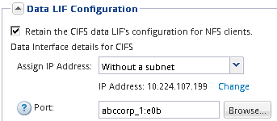

= Cree una nueva SVM con un volumen NFS y una exportación
:allow-uri-read: 
:icons: font
:imagesdir: ../media/

[role="lead"]
Puede utilizar un asistente que le guíe en el proceso de creación de la máquina virtual de almacenamiento (SVM), configurar el sistema de nombres de dominio (DNS), crear una interfaz lógica de datos (LIF), habilitar NFS, configurar NIS opcionalmente y, a continuación, crear y exportar un volumen.

.Antes de empezar
* La red debe estar configurada y los puertos físicos correspondientes deben estar conectados a la red.
* Debe saber cuáles de los siguientes componentes de red utilizará la SVM:
+
** El nodo y el puerto específico en ese nodo en el que se creará la interfaz lógica de datos (LIF)
** Subred desde la que se aprovisionará la dirección IP de la LIF de datos o, si lo desea, la dirección IP específica que desea asignar a la LIF de datos
** Información NIS, si su sitio utiliza NIS para servicios de nombres o asignación de nombres

* La subred debe poder enrutar a todos los servidores externos necesarios para servicios como Servicio de información de red (NIS), Protocolo ligero de acceso a directorios (LDAP), Active Directory (AD) y DNS.
* Todos los firewalls externos deben estar configurados correctamente para permitir el acceso a los servicios de red.
* La hora en las controladoras de dominio de AD, los clientes y la SVM deben sincronizarse con un plazo de cinco minutos entre sí.

.Pasos
. Vaya a la ventana *SVMs*.
. Haga clic en *Crear.*
. En el cuadro de diálogo *Storage Virtual Machine (SVM) Setup*, cree la SVM:
+
.. Especifique un nombre único para la SVM.
+
El nombre debe ser un nombre de dominio completo (FQDN) o seguir otra convención que garantice nombres únicos en un clúster.

.. Seleccione todos los protocolos para los que tenga licencias y para los que pueda usar en la SVM, incluso si no desea configurar todos los protocolos de inmediato.
+
Si finalmente se requiere acceso CIFS, debe seleccionar *CIFS* para que los clientes CIFS y NFS puedan compartir el mismo LIF de datos.

.. Mantenga la configuración de idioma predeterminada, C.UTF-8.
+
[NOTE]
====
Si admite la visualización de caracteres internacional tanto en clientes NFS como SMB/CIFS, considere la posibilidad de utilizar el código de idioma *UTF8MB4*, que está disponible a partir de ONTAP 9.5.

====
+
El volumen que se crea más tarde hereda este idioma y el idioma de un volumen no se puede cambiar.

.. *Opcional*: Si ha activado el protocolo CIFS, cambie el estilo de seguridad a *UNIX*.
+
Al seleccionar el protocolo CIFS, se establece el estilo de seguridad en NTFS de forma predeterminada.

.. *Opcional*: Seleccione el agregado raíz para contener el volumen raíz de SVM.
+
El agregado que seleccione para el volumen raíz no determina la ubicación del volumen de datos. El agregado para el volumen de datos se selecciona de forma automática cuando se aprovisiona almacenamiento en un paso posterior.

+
image::../media/svm_setup_details_unix_selected_nfs.gif[Este gráfico se explica por el texto circundante.]

.. En el área *Configuración DNS*, asegúrese de que el dominio de búsqueda DNS predeterminado y los servidores de nombres son los que desea utilizar para esta SVM.
+
image::../media/svm_setup_details_dns_nfs.gif[Este gráfico se explica por el texto circundante.]

.. Haga clic en *Enviar y continuar*.

+
La SVM se ha creado, pero aún no se han configurado los protocolos.

. En la sección *Configuración de LIF de datos* de la página *Configurar protocolo CIFS/NFS* , especifique los detalles de la LIF que los clientes utilizarán para acceder a los datos:
+
.. Asigne una dirección IP a la LIF de forma automática desde una subred que especifique o introduzca manualmente la dirección.
.. Haga clic en *examinar* y seleccione un nodo y un puerto que se asociarán a la LIF.
+

. Si el área *NIS Configuration* está contraída, amplíelo.
. Si su sitio utiliza NIS para los servicios de nombres o para la asignación de nombres, especifique las direcciones IP y de dominio de los servidores NIS.
+
image::../media/svm_setup_cifs_nfs_page_nis_area_nfs.gif[Este gráfico se explica por el texto circundante.]

. Cree y exporte un volumen para acceder a NFS:
+
.. En *Nombre de exportación*, escriba un nombre que será tanto el nombre de exportación como el comienzo del nombre del volumen.
.. Especifique un tamaño para el volumen que contendrá los archivos.
+
image::../media/svm_setup_cifs_nfs_page_nfs_export_nfs.gif[Captura de pantalla del área en la que se configura la exportación NFS]

+
No es necesario especificar el agregado para el volumen porque se encuentra automáticamente en el agregado con el mayor espacio disponible.

.. En el campo *Permission*, haga clic en *Change* y especifique una regla de exportación que proporcione acceso NFSv3 a un host de administración UNIX, incluido el acceso de superusuario.
+
image::../media/export_rule_for_admin_manual_nfs_nfs.gif[Esta imagen se explica por el texto circundante.]

+
Puede crear un volumen de 10 GB denominado Eng, exportarlo como Eng, y agregar una regla que proporcione al cliente "'admin_host'" acceso completo a la exportación, incluido el acceso de superusuario.

. Haga clic en *Enviar y continuar*.
+
Se crean los objetos siguientes:

+
** Una LIF de datos denominada después del SVM con el sufijo "'_nfs_lif1'"
** Un servidor NFS
** Un volumen situado en el agregado con el mayor espacio disponible y que tenga un nombre que coincida con el nombre de la exportación y termina en el sufijo "'_NFS_volume'"
** Una exportación para el volumen
** Una política de exportación con el mismo nombre que la de exportación

. Para todas las demás páginas de configuración de protocolo que se muestran, haga clic en *Omitir* y configure el protocolo más adelante.
. Cuando aparezca la página *Administración de SVM*, configure o aplace la configuración de un administrador independiente para esta SVM:
+
** Haga clic en *Omitir* y configure un administrador más tarde si es necesario.
** Introduzca la información solicitada y, a continuación, haga clic en *Enviar y continuar*.

. Revise la página *Resumen*, registre cualquier información que necesite más tarde y, a continuación, haga clic en *Aceptar*.
+
Los clientes NFS deben conocer la dirección IP de la LIF de datos.

.Resultados
Se crea una nueva SVM con un servidor NFS que contiene un nuevo volumen exportado para un administrador.
