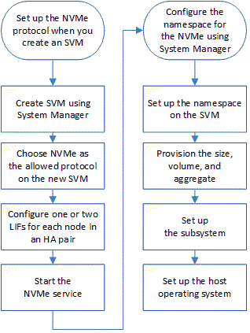

= Configure NVMe con System Manager: ONTAP 9.7 y versiones anteriores
:allow-uri-read: 
:icons: font
:imagesdir: ../media/

[role="lead"]
Puede usar el clásico de System Manager de ONTAP (disponible en ONTAP 9.7 y versiones anteriores) para configurar el protocolo NVMe para una SVM. Cuando se habilita el protocolo NVMe en la SVM, es posible aprovisionar un espacio de nombres o espacios de nombres y asignarles un host y un subsistema.

A partir de ONTAP 9.5, debe configurar al menos un LIF NVMe para cada nodo de una pareja de ha que utilice el protocolo NVMe. También puede definir un máximo de dos LIF NVMe por nodo. Las LIF NVMe se configuran cuando se crean o se editan los ajustes de SVM mediante System Manager.

En la siguiente ilustración, se muestra el flujo de trabajo para configurar NVMe:

