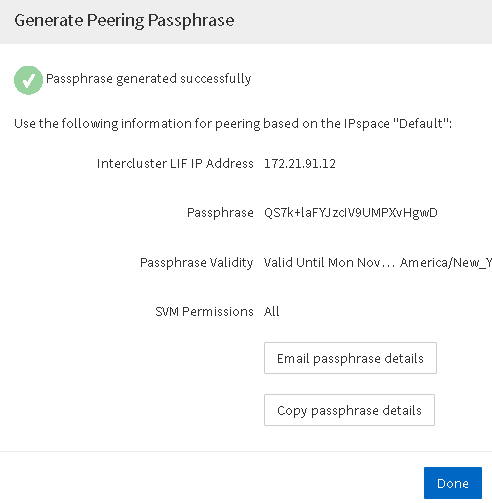

= Crear una relación de paridad de clústeres (a partir de ONTAP 9.3)
:allow-uri-read: 
:icons: font
:imagesdir: ../media/

[role="lead"]
A partir de ONTAP 9.3, hasta ONTAP 9.7, puede usar la interfaz _classic_ de ONTAP para crear una relación entre iguales de clústeres entre dos clústeres, al proporcionar una clave de acceso generada por el sistema y las direcciones IP de las LIF de interconexión de clústeres del clúster remoto.

.Acerca de esta tarea
A partir de ONTAP 9.6, el cifrado de paridad de clústeres está habilitado de forma predeterminada en todas las relaciones de paridad de clústeres que haya creado recientemente. El cifrado de relación de clústeres entre iguales debe habilitarse manualmente para la relación de paridad creada antes de la actualización a ONTAP 9.6. El cifrado de paridad de clústeres no está disponible para los clústeres que ejecutan ONTAP 9.5 o una versión anterior. Por lo tanto, ambos clústeres de la relación de paridad deben ejecutar ONTAP 9.6 para habilitar el cifrado de paridad de clústeres.

El cifrado de interconexión de clústeres utiliza la capa de seguridad de transporte (TLS) para proteger las comunicaciones entre clústeres entre iguales para funciones de ONTAP como SnapMirror y FlexCache.

.Pasos
. En el campo *Target Cluster Intercluster IP address*, introduzca las direcciones IP de las LIF de interconexión de clústeres del clúster remoto.
. [[step2-Passphrase]]genere una clave de acceso desde el clúster remoto.
+
.. Especifique la dirección de gestión del clúster remoto.
.. Haga clic en *URL de administración* para iniciar el Administrador del sistema de ONTAP en el clúster remoto.
.. Inicie sesión en el clúster remoto.
.. En la ventana *Cluster peering*, haga clic en *Generate peering Passphrase*.
.. Seleccione el espacio IP, la validez de la clave de acceso y los permisos de SVM.
+
Puede permitir todas las SVM o las SVM seleccionadas para interconexión de clústeres. Cuando se genera una solicitud del mismo nivel de SVM, las SVM permitidas se relacionan automáticamente con las SVM de origen sin necesidad de aceptar la relación entre iguales de las SVM remotas.

.. Haga clic en *generar*.
+
Se muestra la información de la contraseña.

+

.. Haga clic en *Copiar detalles de contraseña* o *Detalles de contraseña de correo electrónico*.
.. Haga clic en *Listo*.

. En el clúster de origen, introduzca la clave de acceso generada en <<step2-passphrase,Paso 2>>.
. Haga clic en *Iniciar Cluster peering*.
+
La relación de paridad de clústeres se ha creado correctamente.

. Haga clic en *continuar*.

== Qué hacer a continuación

Debe especificar los detalles de la SVM en la ventana SVM peering para continuar con el proceso de paridad.
