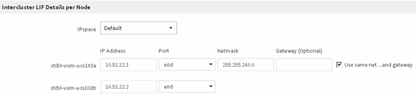

= Crear LIF de interconexión de clústeres (a partir de ONTAP 9.3)
:allow-uri-read: 
:icons: font
:imagesdir: ../media/

[role="lead"]
A partir de ONTAP 9.3, hasta ONTAP 9.7, puede usar la interfaz _classic_ de ONTAP para crear interfaces lógicas de interconexión de clústeres (LIF), lo que permite a la red de clústeres comunicarse con un nodo. Debe crear una LIF de interconexión de clústeres en cada espacio IP que se usará para la relación de paridad, en cada nodo de cada clúster para el que desee crear una relación de paridad.

.Acerca de esta tarea
Por ejemplo, si tiene un clúster de cuatro nodos en el que desea establecer la paridad entre el clúster X en el espacio IP A y entre el clúster y en el espacio IP y, necesitará un total de ocho LIF de interconexión de clústeres; Cuatro en el espacio IP A (uno por nodo) y cuatro en el espacio IP y (uno por nodo).

Este procedimiento debe ejecutarse en ambos clústeres para los que desee crear una relación de paridad.

.Pasos
. Haga clic en *Configuración* > *Configuración avanzada del clúster*.
. En la ventana *Configuración de funciones de clúster avanzadas*, haga clic en *proseguir* junto a la opción *Cluster peering*.
. Seleccione un espacio IP en la lista *espacio IP*.
. Introduzca la dirección IP, el puerto, la máscara de red y los detalles de la puerta de enlace de cada nodo.
+

. Haga clic en *Enviar y continuar*.

== Qué hacer a continuación

Debe introducir los detalles del clúster en la ventana Cluster peering para continuar con el agrupamiento del clúster.
