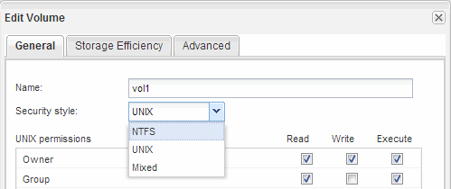

= Cree y configure un volumen
:allow-uri-read: 
:icons: font
:imagesdir: ../media/

[role="lead"]
Se debe crear un volumen de FlexVol para contener los datos. Si lo desea, se puede cambiar el estilo de seguridad predeterminado del volumen, que se hereda del estilo de seguridad del volumen raíz. También se puede cambiar de manera opcional la ubicación predeterminada del volumen en el espacio de nombres, que está en el volumen raíz de la máquina virtual de almacenamiento (SVM).

.Pasos
. Vaya a la ventana *Volumes*.
. Haga clic en *Crear* > *Crear FlexVol*.
+
Se muestra el cuadro de diálogo Crear volumen.

. Si desea cambiar el nombre predeterminado, que finaliza con una Marca de fecha y hora, especifique un nuevo nombre, por ejemplo `vol1`.
. Seleccione un agregado para el volumen.
. Especifique el tamaño del volumen.
. Haga clic en *Crear*.
+
De forma predeterminada, todos los volúmenes nuevos que se creen en System Manager se montan en el volumen raíz mediante el nombre del volumen como nombre de unión. Puede utilizar la ruta de unión y el nombre de la unión al configurar los recursos compartidos CIFS.

. *Opcional*: Si no desea que el volumen esté ubicado en la raíz del SVM, modifique el lugar del nuevo volumen en el espacio de nombres existente:
+
.. Vaya a la ventana *espacio de nombres*.
.. Seleccione *SVM* en el menú desplegable.
.. Haga clic en *Mount*.
.. En el cuadro de diálogo *Mount Volume*, especifique el volumen, el nombre de su ruta de unión y la ruta de unión en la que desea montar el volumen.
.. Compruebe la nueva ruta de unión en la ventana *espacio de nombres*.

+
Si desea organizar determinados volúmenes en un volumen principal denominado «data», puede mover el nuevo volumen «'vol1» del volumen raíz al volumen «dATA».

. Revise el estilo de seguridad del volumen y cámbielo, si es necesario:
+
.. En la ventana *volumen*, seleccione el volumen que acaba de crear y haga clic en *Editar*.
+
Se muestra el cuadro de diálogo Edit Volume, en el que se muestra el estilo de seguridad actual del volumen, que se hereda del estilo de seguridad del volumen raíz de la SVM.

.. Asegúrese de que el estilo de seguridad sea NTFS.
+

