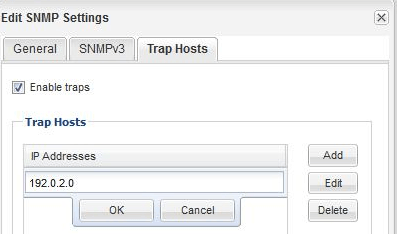

= Añada un host de capturas de SNMP
:allow-uri-read: 
:icons: font
:imagesdir: ../media/

[role="lead"]
Puede usar la interfaz _classic_ de System Manager de ONTAP con ONTAP 9,7 o versiones anteriores para añadir un host de capturas (administrador SNMP) para recibir notificaciones SNMP (unidades de datos de protocolo de capturas SNMP) cuando se generan capturas en el clúster.

.Antes de empezar
IPv6 debe estar habilitado en el clúster si configura los hosts de capturas de SNMP que tienen direcciones IPv6.

.Acerca de esta tarea
SNMP y las capturas de SNMP se habilitan de forma predeterminada. El informe técnico TR-4220 de NetApp para compatibilidad con SNMP contiene listas de todos los eventos predeterminados que se admiten con las capturas SNMP.

http://www.netapp.com/us/media/tr-4220.pdf["Informe técnico de NetApp 4220: Soporte de SNMP en Data ONTAP"^]

.Pasos
. En la ventana SNMP, haga clic en *EDITAR* para abrir el cuadro de diálogo *Editar configuración SNMP*.
. [[sta2-Verify-enable-traps]]en la pestaña *Trap hosts*, compruebe que la casilla de verificación *Enable traps* está activada y haga clic en *Agregar*.
. [[sta3-enter-TrapHost-ip]]Introduzca la dirección IP del host de capturas y, a continuación, haga clic en *OK* en el panel *Trap hosts*.
+
La dirección IP de un host de capturas de SNMP puede ser IPv4 o IPv6.

+

. Para añadir otro host de capturas, repita <<step2-verify-enable-traps,Paso 2>> y.. <<step3-enter-traphost-ip,Paso 3>>.
. Cuando termine de agregar hosts de capturas, haga clic en *Aceptar* en el cuadro de diálogo *Editar configuración de SNMP*.

