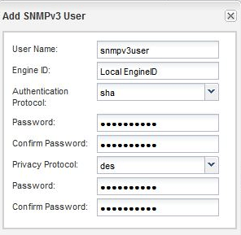

= Agregue un usuario de seguridad SNMPv3
:allow-uri-read: 
:icons: font
:imagesdir: ../media/

[role="lead"]
Puede usar la interfaz _classic_ del administrador del sistema de ONTAP con ONTAP 9.7 o una versión anterior para añadir un usuario SNMPv3 a nivel de clúster.

El usuario SNMPv3 puede ejecutar utilidades SNMP desde el host de capturas (administrador SNMP) mediante la configuración de autenticación y privacidad que especifique. SNMPv3 ofrece seguridad avanzada mediante passphrases y cifrado.

.Acerca de esta tarea
Al agregar un usuario SNMPv3 a nivel de clúster, ese usuario puede acceder al clúster a través de todas las LIF que tienen aplicada la política de firewall «mgmt».

.Pasos
. En la ventana SNMP, haga clic en *Editar* para abrir el cuadro de diálogo *Editar configuración SNMP*.
. En la ficha *SNMPv3*, haga clic en *Agregar* para abrir el cuadro de diálogo *Agregar usuario SNMPv3*.
. Introduzca los siguientes valores:
+
.. Introduzca un nombre de usuario de SNMPv3.
+
Un nombre de usuario de seguridad no debe superar los 31 caracteres y no debe contener los siguientes caracteres especiales:

+
`, / : " ' |`

.. Para ID de motor, seleccione el valor predeterminado `Local Engine ID`.
+
El ID del motor se utiliza para generar claves de autenticación y cifrado para los mensajes SNMPv3.

.. Seleccione un protocolo de autenticación e introduzca una contraseña de autenticación.
+
La contraseña debe contener un mínimo de ocho caracteres.

.. Opcional: Seleccione un protocolo de privacidad e introduzca una contraseña para él.

+

. Haga clic en *Aceptar* en el cuadro de diálogo *Agregar usuario SNMPv3*.
+
Puede agregar varios nombres de usuario de seguridad, haciendo clic en *Aceptar* después de cada adición. Por ejemplo, si utiliza SNMP para supervisar diferentes aplicaciones que requieren privilegios diferentes, puede que necesite agregar un usuario SNMPv3 para cada función de supervisión o administración.

. Cuando termine de agregar nombres de usuario, haga clic en *Aceptar* en el cuadro de diálogo *Editar configuración SNMP*.

