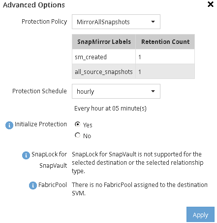

= Crear la relación de SnapMirror (a partir de ONTAP 9.3)
:allow-uri-read: 
:icons: font
:imagesdir: ../media/

[role="lead"]
Debe crear una relación de SnapMirror entre el volumen de origen en un clúster y el volumen de destino en el clúster con una relación entre iguales para replicar datos para la recuperación de desastres.

.Antes de empezar
* El agregado de destino debe tener espacio disponible.
* Ambos clústeres deben configurarse y configurarse de manera adecuada para satisfacer los requisitos del entorno para acceso de usuarios, autenticación y acceso de clientes.

.Acerca de esta tarea
Debe realizar esta tarea desde el clúster *fuente*.

.Pasos
. Haga clic en *almacenamiento* > *volúmenes*.
. Seleccione el volumen para el que desea crear una relación de réplica y, a continuación, haga clic en *acciones* > *proteger*.
. En la sección *Tipo de relación*, seleccione *espejo* en la lista desplegable *Tipo de relación*.
. En la página *Volumes: Protect Volumes*, proporcione la siguiente información:
+
.. Seleccione *Simetría* como el tipo de relación.
.. Seleccione el clúster de destino, la SVM de destino y el sufijo para el nombre del volumen de destino.
+
Solo se enumeran las SVM con una relación entre iguales y las SVM permitidas en las SVM de destino.

.. Haga clic en image:../media/advanced_options_icon_disaster.gif["Icono de opciones avanzadas"].
.. En el cuadro de diálogo *Opciones avanzadas*, compruebe que `MirrorAllSnapshots` se establece como política de protección.
+
`DPDefault` y.. `MirrorLatest` Son las otras políticas de protección predeterminadas que están disponibles para las relaciones de SnapMirror.

.. Seleccione un programa de protección.
+
De forma predeterminada, la `hourly` se ha seleccionado el programa.

.. Compruebe que *Sí* está seleccionado para inicializar la relación de SnapVault.
+
De forma predeterminada, todas las relaciones de protección de datos se inicializan. La inicialización de la relación de SnapMirror garantiza que el volumen de destino tenga una línea de base para comenzar a proteger el volumen de origen.

.. Haga clic en *aplicar* para guardar los cambios.
+

. Haga clic en *Guardar* para crear la relación de SnapMirror.
. Compruebe que el estado de la relación de SnapMirror esté en la `Snapmirrored` estado.
+
.. Desplácese hasta la ventana *Volumes* y, a continuación, seleccione el volumen para el que creó la relación de SnapMirror.
.. Haga doble clic en el volumen para ver los detalles del volumen y, a continuación, haga clic en *PROTECTION* para ver el estado de la protección de datos del volumen.

+
image::../media/snapmirror_9_3.gif[Captura de pantalla del estado de SnapMirror]

== Qué hacer a continuación

Debe anotar la configuración del volumen de origen, como thin provisioning, deduplicación, compresión y crecimiento automático. Puede utilizar esta información para comprobar la configuración del volumen de destino al romper la relación de SnapMirror.
