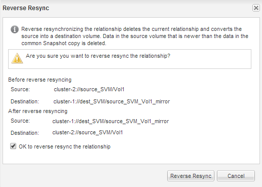

= Resincronice el volumen de origen
:allow-uri-read: 
:icons: font
:imagesdir: ../media/

[role="lead"]
Cuando el volumen de origen esté en línea, es necesario volver a sincronizar los datos entre el volumen de destino y el volumen de origen para replicar los datos más recientes del volumen de destino.

.Antes de empezar
El volumen de origen debe estar en línea.

.Acerca de esta tarea
Debe realizar la tarea desde el clúster *destino*.

En la siguiente imagen, se muestra que los datos se replican del volumen de destino activo al volumen de origen de solo lectura:

image::../media/reverse_resync_2555.gif[En la siguiente imagen, se muestran los datos que se replican desde el volumen de destino activo al volumen de origen de solo lectura]

.Pasos
. Según la versión de System Manager que esté ejecutando, realice uno de los pasos siguientes:
+
** ONTAP 9.4 o anterior: Haga clic en *Protección* > *Relaciones*.
** A partir de ONTAP 9.5: Haga clic en *Protección* > *Relaciones de volumen*.

. Seleccione la relación de SnapMirror entre los volúmenes de origen y de destino.
. Anote el programa de transferencia y la política configurada para la relación de SnapMirror.
. Haga clic en *Operaciones* > *Reverse Resync*.
. Active la casilla de verificación de confirmación y, a continuación, haga clic en *Reverse Resync*.
+

+
A partir de ONTAP 9.3, la política de SnapMirror de la relación se establece en `MirrorAllSnapshots` y el programa de mirroring se estableció en `None`.

+
Si utiliza ONTAP 9.2 o una versión anterior, la política de SnapMirror de la relación se establece en `DPDefault` y el programa de mirroring se estableció en `None`.

. En el clúster de origen, especifique una política y una programación de SnapMirror que coincidan con la configuración de protección de la relación de SnapMirror original:
+
.. Según la versión de System Manager que esté ejecutando, realice uno de los pasos siguientes:
+
*** ONTAP 9.4 o anterior: Haga clic en *Protección* > *Relaciones*.
*** A partir de ONTAP 9.5: Haga clic en *Protección* > *Relaciones de volumen*.

.. Seleccione la relación SnapMirror entre el volumen de origen que se resincronizaba y el volumen de destino y, a continuación, haga clic en *Editar*.
.. Seleccione la política y la programación de SnapMirror y haga clic en *Aceptar*.

