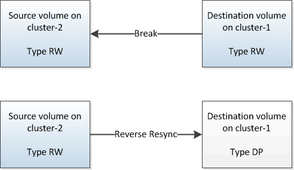

= Vuelva a activar el volumen de origen
:allow-uri-read: 
:icons: font
:imagesdir: ../media/

[role="lead"]
Después de volver a sincronizar los datos del volumen de destino con el volumen de origen, debe activar el volumen de origen mediante la interrupción de la relación de SnapMirror. A continuación, se debe volver a sincronizar el volumen de destino para proteger el volumen de origen reactivado.

.Acerca de esta tarea
Tanto las operaciones de pausa como de resincronización inversa se realizan desde el clúster de *fuente*.

En la siguiente imagen, se muestra que los volúmenes de origen y destino son de lectura/escritura al interrumpir la relación de SnapMirror. Tras la operación de resincronización inversa, los datos se replican del volumen de origen activo al volumen de destino de solo lectura.

.Pasos
. Según la versión de System Manager que esté ejecutando, realice uno de los pasos siguientes:
+
** ONTAP 9.4 o anterior: Haga clic en *Protección* > *Relaciones*.
** A partir de ONTAP 9.5: Haga clic en *Protección* > *Relaciones de volumen*.

. Seleccione la relación de SnapMirror entre los volúmenes de origen y de destino.
. Haga clic en *Operaciones* > *Quiesce*.
. Active la casilla de verificación de confirmación y, a continuación, haga clic en *Quiesce*.
. Haga clic en *Operaciones* > *rotura*.
. Active la casilla de verificación de confirmación y, a continuación, haga clic en *interrumpir*.
+
image::../media/snapmirror_return_break.gif[Captura de pantalla que muestra el cuadro de diálogo romper.]

. Haga clic en *Operaciones* > *Reverse Resync*.
. Active la casilla de verificación de confirmación y, a continuación, haga clic en *Reverse Resync*.
+
image::../media/snapmirror_return_reverse_resync.gif[Captura de pantalla que muestra el cuadro de diálogo Reverse Resync.]

+
A partir de ONTAP 9.3, la política de SnapMirror de la relación se establece en `MirrorAllSnapshots` La programación de SnapMirror se establece en `None`.

+
Si utiliza ONTAP 9.2 o una versión anterior, la política de SnapMirror de la relación se establece en `DPDefault` La programación de SnapMirror se establece en `None`.

. Desplácese hasta el volumen de origen de la página Volumes y compruebe que la relación de SnapMirror que ha creado se encuentre en una lista y el estado de la relación sea `Snapmirrored`.
. En el clúster de destino, especifique una política y una programación de SnapMirror que coincidan con la configuración de protección de la relación de SnapMirror original para la nueva relación de SnapMirror:
+
.. Según la versión de System Manager que esté ejecutando, realice uno de los pasos siguientes:
+
*** ONTAP 9.4 o anterior: Haga clic en *Protección* > *Relaciones*.
*** A partir de ONTAP 9.5: Haga clic en *Protección* > *Relaciones de volumen*.

.. Seleccione la relación de SnapMirror entre el origen reactivado y los volúmenes de destino y, a continuación, haga clic en *Editar*.
.. Seleccione la política y la programación de SnapMirror y haga clic en *Aceptar*.

.Resultados
El volumen de origen tiene acceso de lectura/escritura y está protegido por el volumen de destino.
