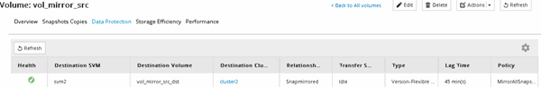

= Compruebe el estado del volumen de origen
:allow-uri-read: 
:icons: font
:imagesdir: ../media/

[role="lead"]
Si el volumen de origen no está disponible, debe verificar que el volumen de origen esté sin conexión y luego identificar el volumen de destino que debe activarse para ofrecer acceso a los datos.

.Acerca de esta tarea
Debe realizar esta tarea desde el clúster *fuente*.

.Pasos
. Vaya a la ventana *Volumes*.
. Seleccione el volumen de origen y, a continuación, compruebe que el volumen de origen esté sin conexión.
. Identificar el volumen de destino en la relación de SnapMirror.
+
** A partir de ONTAP 9.3: Haga doble clic en el volumen de origen para ver los detalles y, a continuación, haga clic en *PROTECCIÓN* para identificar el volumen de destino en la relación de SnapMirror y el nombre de la SVM que contiene el volumen.
+

** ONTAP 9.2 o una versión anterior: Haga clic en la pestaña *Protección de datos* de la parte inferior de la página Volumes para identificar el volumen de destino en la relación de SnapMirror y el nombre de la SVM que contiene el volumen.
+
image::../media/volume_status_2.gif[La imagen muestra el volumen de destino]

