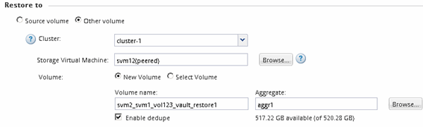

= Restaurar datos desde un backup de SnapVault
:allow-uri-read: 
:icons: font
:imagesdir: ../media/

[role="lead"]
Después de seleccionar el volumen de destino de un backup de SnapVault, se debe ejecutar la operación de restauración en un volumen nuevo para probar los datos de un backup o en un volumen existente para restaurar los datos perdidos o dañados.

.Acerca de esta tarea
Debe realizar esta tarea desde el clúster *destino*.

.Pasos
. Según la versión de System Manager que esté ejecutando, realice uno de los pasos siguientes:
+
** ONTAP 9.4 o anterior: Haga clic en *Protección* > *Relaciones*.
** A partir de ONTAP 9.5: Haga clic en *Protección* > *Relaciones de volumen*.

. Seleccione la SVM que contiene el volumen de destino de la copia de seguridad de SnapVault y, a continuación, haga clic en *Operaciones* > *Restaurar*.
. En el cuadro de diálogo *Restaurar*, restaure los datos al volumen de origen original o a un volumen nuevo:
+
|===
| Si desea restaurar en... | Realice lo siguiente... 

 a| 
El volumen de origen original
 a| 
Seleccione *volumen de origen*.

 a| 
Un volumen nuevo
 a| 
.. Seleccione *otro volumen*.
.. Seleccione el clúster con una relación entre iguales y la SVM para el volumen.
.. Seleccione una SVM con una relación entre iguales de la lista.
.. Si la SVM no tiene una relación entre iguales, cree la relación entre iguales de SVM:
+
... Seleccione la SVM.
... Haga clic en *autenticar*.
... Introduzca las credenciales del administrador del clúster del clúster con relación entre iguales y, a continuación, haga clic en *Crear*.

.. Seleccione *Nuevo volumen*.
.. Si desea cambiar el nombre predeterminado, aparecerá en el formato `destination_SVM_name_destination_volume_name_restore`, especifique un nuevo nombre y seleccione el agregado que contiene para el volumen.
.. Active la casilla de verificación *Activar deduplicación*.

|===
+

. Seleccione la copia de Snapshot más reciente o seleccione una copia de Snapshot específica que desee restaurar.
. Active la casilla de verificación *Aceptar para restaurar el volumen desde la copia Snapshot*.
. Active la casilla de verificación *Activar compresión de red* para comprimir los datos que se transfieren durante la operación de restauración.
. Haga clic en *Restaurar*.
+
Durante el proceso de restauración, el volumen que se restaura cambia a solo lectura. Cuando se complete la operación de restauración, la relación temporal se eliminará y el volumen restaurado cambiará a de lectura/escritura.

+
image::../media/restore_configuration.gif[Resultado de la operación de restauración de volumen]

. Haga clic en *Aceptar* en el cuadro de mensaje.

